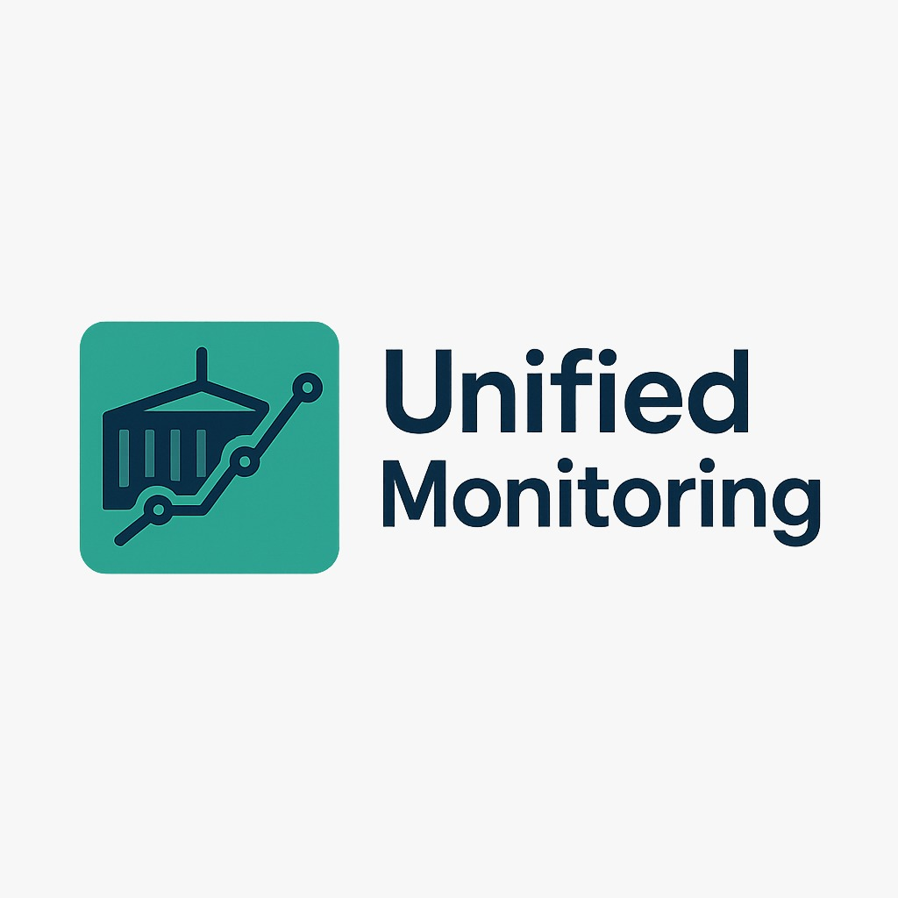
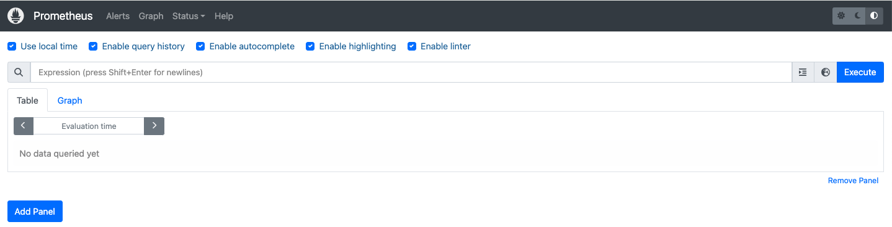

# Unified Monitor 🚀📊

[](https://hub.docker.com/r/yjani204/unified-monitoring)

<p align="center">
  
</p>


> **One container. Full‑stack observability.**  
> Metrics, Logs & Traces for every Dockerized micro‑service in **under 60 seconds**.

---

## ✨ Key Features

| 📈 | **Metrics** – Prometheus scrapes container & node metrics out‑of‑the‑box, feeding beautiful <br/> Grafana dashboards (Node Exporter, cAdvisor, Blackbox…).|
|---|---|
| 📜 | **Logs** – Loki & Promtail centralize stdout/stderr logs with instant log‑query correlations.|
| 📡 | **Traces** – OpenTelemetry Collector + Tempo deliver end‑to‑end distributed tracing.|
| 🚀 | **Single‑run bootstrap** – One `docker run`/`docker compose up` spawns the entire stack.|
| ⚡ | **Low‑touch** – Auto‑discovers all containers via Docker API; zero code changes required.|
| 🔔 | **Alerting** – Pre‑wired Alertmanager routes Prometheus/Loki alerts to Slack, email & more.|
| 🛡️ | **Self‑healing** – Health‑checks & `restart: unless‑stopped` ensure continuous uptime.|
| 📦 | **Tiny footprint** – Alpine‑based image (< 550 MB) optimised for laptops & edge hosts.|

---

## 🖼️ Live Demo

<p align="center">
  
</p>

----
[View PDF](resource/cAdvisor.pdf)

[](resource/cAdvisor.pdf)

---

## 🔧 Quick Start

```bash
# Pull latest stable image
docker pull yjani204/unified-monitoring:latest

# Fire up the entire monitoring suite
# (Grafana 3000, Prometheus 9090, Alertmanager 9093, Loki 3100, Tempo 3200, OTLP 4318, NodeExporter 9100, cAdvisor 8080)
docker run -d --name auto-mon \
  -p 3000:3000  \ # Grafana UI
  -p 9090:9090  \ # Prometheus
  -p 9093:9093  \ # Alertmanager
  -p 3100:3100  \ # Loki
  -p 4318:4318  \ # OTLP gRPC/HTTP
  -p 3200:3200  \ # Tempo
  -p 9100:9100  \ # Node Exporter
  -p 8080:8080  \ # cAdvisor
  -v /var/run/docker.sock:/var/run/docker.sock \
  yjani204/unified-monitoring:latest
```

> 🕒 **Ready in ~1 minute** 🚀
```
> Grafana → http://localhost:3000
> Prometheus → http://localhost:9090
> Alertmanager → http://localhost:9093
> Loki → http://localhost:3100
> cAdvisor → http://localhost:8080 
```

---
### Docker Compose

Prefer compose? Copy `deploy/docker-compose.yml` and simply run:

```bash
docker compose up -d
```

---

## ⚙️ Configuration

| Component | Default Config Path | Notes |
|-----------|--------------------|-------|
| Prometheus | `/etc/prometheus/prometheus.yml` | Scrape interval 15 s, Docker service discovery |
| Grafana | `/etc/grafana/` | Pre‑provisioned dashboards & data‑sources |
| Loki | `/etc/loki/local-config.yaml` | Retention 7 days (configurable) |
| Tempo | `/etc/tempo/tempo.yaml` | Object storage disabled by default |
| Alertmanager | `/etc/alertmanager/alertmanager.yml` | Sample Slack/email routes commented |
| Otel Collector | `/etc/otelcol/config.yaml` | Receives OTLP gRPC & HTTP |

Customise configs by mounting your own files with `-v /path:/container/path`.

---

## 📊 Pre‑built Dashboards

* **System Metrics** – CPU, Memory, Disk, Network (Node Exporter)
* **Docker Containers** – Per‑container resources (cAdvisor)
* **Application Traces** – Flamegraphs & span drill‑downs (Tempo)
* **Alert Overview** – Firing & silenced alerts (Alertmanager)

> Have a killer dashboard? 🔥  Send a PR to `dashboards/` and get featured!

---

## 🚀 Roadmap

- [ ] Kubernetes Helm chart
- [ ] ARM64 image build
- [ ] SAML/SSO auth for Grafana
- [ ] Cloud‑native storage back‑ends (S3/GCS for Loki & Tempo)

---

## 🤝 Contributing

1. **Fork** the repo & create your branch: `git checkout -b feat/my-new-feature`  
2. **Commit** your changes: `git commit -m 'feat: add feature'`  
3. **Push** to the branch: `git push origin feat/my-new-feature`  
4. **Open** a pull request – we’ll review ASAP 🙌

Looking for ideas? Check the [issues](https://github.com/yashjani/Unified-Monitor/issues) page or open a discussion.

---
